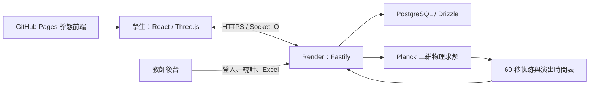

# STEAM 陀螺模擬器｜Bayblad Simulator

以香港中學 Maker／STEAM 課堂為背景的開源設計及線上對戰平台。學生設計三層陀螺，觀察重量、重心與相對能力值，再以節拍發射與真人或電腦玩家對戰；教師可查看紀錄、分析及匯出 Excel。

這是教學模擬與遊戲，不是實物安全認證、精密工程求解器或官方爆旋陀螺產品。預測與動畫不能代替實物測試。

## 線上測試網站

| 入口 | 用途 |
| --- | --- |
| [學生測試網站](https://yuenhk.github.io/Bayblad-Simulator/) | 設計、預覽、房間及對戰，不要求手動輸入個人資料 |
| [教師後台](https://bayblad-simulator-api.onrender.com/admin/) | 須獲授權帳號登入，教師密碼不公開 |
| [後端健康檢查](https://bayblad-simulator-api.onrender.com/health/ready) | 伺服器、資料庫及遷移就緒狀態 |
| [建置與測試紀錄](https://github.com/YuenHK/Bayblad-Simulator/actions) | GitHub Actions 結果 |

公開站可能保留訪客對戰紀錄，請勿輸入真實學生或機密資料。請在自己的環境進行大量／負載測試，不要對共用測試站施加壓力。

Render 免費後端閒置後可能需要啟動時間。學生端單次身份請求最多等候 10 秒，暫時失敗時相隔 2 秒自動重試，最多六次；顯示喚醒提示，最終失敗可按「重試連線」。這不是持續保活，也不保證免費平台隨時即時可用。

## 學生功能

- **三層設計**：圓形、多邊形、星形、波浪形；調整直徑、角數、圓角、旋轉及排序。現版為參數化形狀，不是自由繪畫。
- **裝配**：三層共用螺絲配置；金屬圓碟只放最底層下方，由軸心夾住，不讓固定螺絲穿過金屬碟。
- **預覽及驗證**：俯視、分解及 3D；即時計算重量、平面重心、轉動慣量及能力值，提示不符合課堂規格的參數。
- **房間與觀賽**：兩個對戰席位、觀賽區、房間碼與大廳；房主可讓出席位。觀賽區仍受主機效能及防濫用限制，不能理解成無限容量。
- **節拍發射**：判定越準，初始轉速及推力倍率越高；沒有判定也以 Miss／最低倍率發射。玩家只看自己的判定，觀眾可看雙方判定。
- **完整演出**：每輪 60 秒，最後 12 秒召喚生肖、最後 6 秒決勝演出，含 3D 陀螺、能量環、光影、粒子、技能文字及音效。目前生肖模型為簡化幾何風格。
- **賽後及重賽**：整場完成後顯示對戰分、挑戰分及總分；返回同房再次準備。學生對戰端不顯示排行榜或自動戰術建議。
- **電腦玩家**：房主可加入／移除；隨機判定，使用已完成賽事中最熱門的合規設計，無紀錄時使用預設設計。

## 教師功能與身份限制

後台提供登入、對戰紀錄、設計參數、日期時間、身份／裝置狀態、排行榜、使用量及參數分析。Excel 含六張工作表：對戰紀錄、逐輪結果、陀螺參數、身份及裝置狀態、使用量統計、參數分析。統計中較高分的參數不是保證獲勝的物理最佳解。

一般網頁不能直接讀取 iPad 系統裝置名稱、MAC 位址或其他網站的瀏覽歷史。專案支援受信任的 iClass／WebClip 整合，但需要部署者配置及校方配合；2026-09-08 核實的公開後端使用 `guest-only-explicit` 訪客模式。

Cookie／不透明憑證可延續同一瀏覽器身份；清除儲存或關閉無痕工作階段後不能保證保留。IP／User-Agent 只供有限診斷，不能可靠當成班別學號。開源授權不包含學生資料或存取正式後台的權利。

## 系統架構



| 目錄 | 職責 |
| --- | --- |
| `apps/web` | 學生／教師入口、設計、房間、圖表與 3D 演出 |
| `apps/server` | 身份、登入、即時事件、發射、物理、紀錄、分析、Excel |
| `packages/domain` | 設計、幾何、質量、課堂規則及能力模型 |
| `packages/protocol` | Zod 驗證與版本化資料契約 |
| `packages/db`、`drizzle` | 資料庫模型及遷移 |
| `tests` | 整合、端對端、安全、公開站及負載測試 |
| `scripts`、`infra` | 部署、備份、還原及稽核工具 |

伺服器重新驗證設計、決定勝負及計分，前端負責呈現。GitHub Pages 不能單獨取代即時後端和資料庫。

## 運算原理

從參數產生輪廓 → 驗證裝配 → 計算淨面積、質量、重心與慣量 → 相對能力值＋發射倍率 → 伺服器物理求解 → 60 秒同步 3D 演出。

**內部物理求解時間不等於畫面播放時間**；召喚獸及鏡頭不重新決定勝負。完整公式、判定門檻及計分見 [架構與運算原理](docs/technical-guide.zh-Hant.md)。

## 本機開發與測試

需要 Git、Node.js 24 或以上及 pnpm 11.19.0。部分部署契約測試另需 Ruby、Bash、OpenSSH；PostgreSQL／容器驗收需要相應資料庫及 Docker 環境。

```bash
git clone https://github.com/YuenHK/Bayblad-Simulator.git
cd Bayblad-Simulator
corepack enable
corepack prepare pnpm@11.19.0 --activate
pnpm install --frozen-lockfile
pnpm exec playwright install chromium
pnpm lint
pnpm typecheck
pnpm test
pnpm test:e2e
```

`test:e2e` 自動啟動測試用 Fastify／Socket.IO、學生 production build 預覽及教師頁，不需要正式帳密。這套測試伺服器不可當正式服務公開。`pnpm dev` 是工作區開發入口，不會自動供應完整正式資料庫、身份與部署環境；首次驗證整体流程建議先用 `test:e2e`。

```bash
# 本機完整 60 秒人機演出，可能需要數分鐘
pnpm test:cinematic

# 公開學生站：模擬兩次暫時失敗，再連真正 API
pnpm exec playwright test --config playwright.public.config.ts --project chromium-desktop --grep 'cold server'

# 公開人機驗收：會新增測試對戰紀錄
CINEMATIC_BATTLES=1 pnpm exec playwright test --config playwright.public.config.ts --project chromium-desktop --grep 'computer battle'
```

教師公開站測試需獲授權者安全提供 `PUBLIC_ADMIN_PASSWORD` 環境變數；未提供則跳過，不是通過。不要把密碼寫入檔案、提交紀錄或共享終端指令。其他入口包括 `test:security`、`test:load`，執行前閱讀其設定與環境要求。

## 部署與資料保存

目前測試站為 GitHub Pages＋Render Docker＋PostgreSQL。Fork 後應建立自己的服務及密鑰，不應沿用本專案正式後台。

1. 配置自己的 HTTPS 後端、PostgreSQL、Origins、教師密碼與獨立簽章密鑰，參考 [環境設定](docs/operations/environment.md) 及 [.env.example](.env.example)。
2. 後端參考 `Dockerfile.server`、`scripts/migrate-and-start.sh`、`apps/server/src/config.ts`。映像 build 需要核實的 Node digest；須明確配置遷移啟動流程，不能假定預設 CMD 會自動遷移。
3. 前端部署見 [.github/workflows](.github/workflows)，設定自己的 `STUDENT_API_ORIGIN` 及後端允許的學生 Origin。
4. 驗證健康檢查、身份、完整對戰及教師匯出；部署成功不是功能驗收的替代品。

自管主機的受保護發布、備份與還原見 [發布流程](docs/operations/release.md) 及 [持久化工作](docs/operations/persistence-jobs.md)。此路徑與現有 Render 不同，也不代表已為你的 Fork 配置完成。永久保留需要持久化資料庫、備份與還原驗證，不能靠免費容器檔案系統保證。

## 驗收狀態與限制

2026-09-08，`00c2c89` 已部署至 Render 及 Pages。公開 Chromium 完成人機整場對戰、返回同房重賽及喚醒恢復；教師登入、統計與 Excel 補測通過；前端 152 項測試通過。既有跨瀏覽器紀錄見 [驗收紀錄](docs/operations/acceptance-2026-09-07.md)。

實體 iPad、音效聆聽、動畫美術品質、真實班級負載及免費平台長期可用性仍須另測。[該版本 CI](https://github.com/YuenHK/Bayblad-Simulator/actions/runs/34171866024) 的 quality 通過、production-security 失敗，不能寫成全部通過。最新結果以 Actions 為準。

## 開源授權及安全

本專案有權授權的自有程式及隨附說明採用 [MIT License](LICENSE)。允許公開閱讀、使用、複製、修改、合併、發布、再散布、再授權及商業使用；複製或散布全部或重要部分時須保留版權及授權聲明。軟體按現狀提供，不作擔保。標準來源：[Open Source Initiative](https://opensource.org/license/mit)，以本庫 `LICENSE` 英文條款為準。

第三方套件、商標及外部素材各自保留其條款；學生資料、正式資料庫、憑證或未由本專案擁有權利的課程文件不在授權範圍。見 [第三方聲明](THIRD_PARTY_NOTICES.md)。

舊提交曾含部署密碼字串。新版移除目前檔案的明碼，但 Git 歷史／複本仍可能保留，部署者必須輪換已曝光憑證；單純刪除檔案不會恢復保密。本次文件更新不會自行修改線上密碼或改寫歷史。

歡迎提交不含個人資料的 Issue／Pull Request；請勿公開帳密、學生名單、IP 紀錄或敏感匯出檔。
