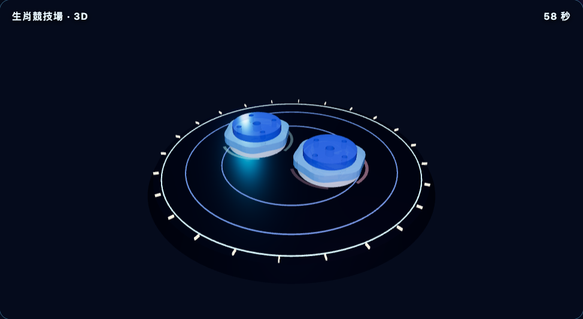
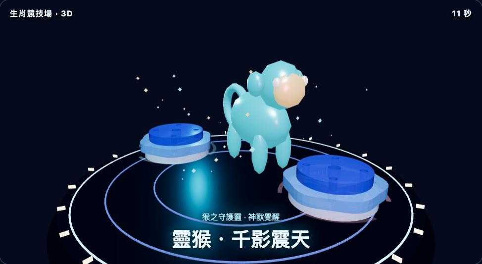
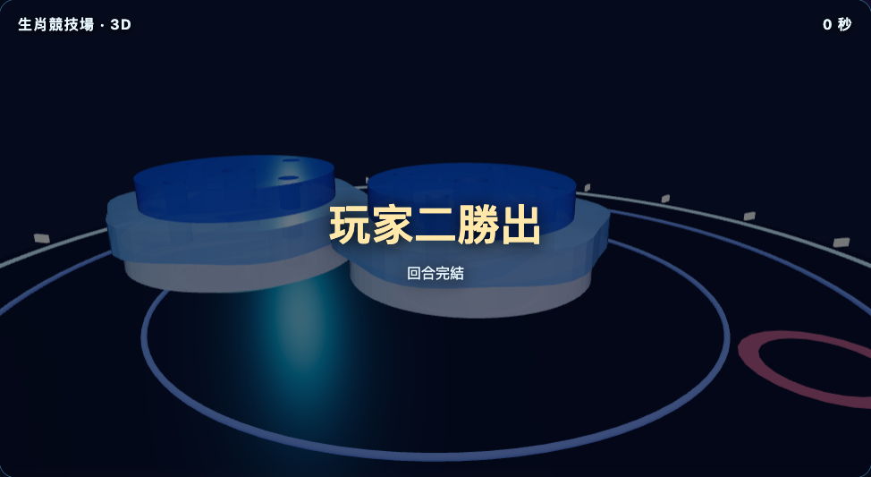

# 2026-09-07 公開網站驗證紀錄

公開學生網站及 Render `/health/ready` 均回應 HTTP 200；健康檢查回報 database、migration 為 ok。第一次 API 探測曾逾時，其後重新探測正常。

## 已完成的自動化驗收

- 桌面 Chromium：學生設計、限制及預覽；老師登入、統計、排行榜及 Excel 下載。
- 桌面 Chromium：兩個獨立訪客完成同步對戰；每輪伺服器時間表為 60,000 ms；尾聲召喚、最後一擊及結果階段；賽後顯示計分；返回同一房間並再次準備。
- Firefox：學生設計與老師後台，2 項通過。
- WebKit iPad 尺寸模擬：學生設計與老師後台，2 項通過。
- Chromium 手機尺寸模擬：學生設計與老師後台，2 項通過。

另以桌面 Chromium 補測 Excel 下載檔：ZIP 完整性檢查通過，workbook.xml 包含對戰紀錄、逐輪結果、陀螺參數、身份及裝置狀態、使用量統計、參數分析六張工作表；完整登入及匯出重測通過（9.0 秒）。檢查沒有輸出學生儲存格內容。

補測首次遇到 Render 的「Service waking up」頁面，20 秒內未出現教師登入頁。其後健康檢查回復 HTTP 200，再次測試成功。這是本次實際觀察到的啟動延遲，不能宣稱平台隨時即時可用。新增的工作表檢查亦修正為不依賴 XML 屬性順序。

桌面對戰第一次測試因直接比較本機時鐘與伺服器時間戳失敗；改以畫面已同步的 elapsed time 建立本機時間基準後，完整對戰重測通過（2.6 分鐘）。共同伺服器時間表、每輪 60 秒及階段邊界的斷言仍保留。

## 證據範圍

以上測試驗證頁面操作、3D canvas 可見、演出階段與同步時間、計分及重賽流程。手機與 iPad 為瀏覽器模擬，未代表實體裝置驗收。

其後另跑兩次公開雙訪客對戰，分別用時 2.6 及 3.7 分鐘，均通過。後者保存三輪的 battle、summon、strike、result 圖片，並直接查看其中八張，確認 3D 陀螺、能量環、龍／猴召喚模型、技能名稱及勝負畫面出現；模型是簡化幾何風格，不代表動畫電影級畫質驗收。未完成聲音聆聽、逐幀動畫品質或實體 iPad 驗收。

畫面截圖只包含 3D 畫布，不包含學生識別資料：

重現截圖報告時使用 `PUBLIC_CAPTURE_ARENA=1` 及 Playwright HTML 報告；只有文字 reporter 不會持久保存這些記憶體附件。

## CI 驗收

提交 `20f6041` 的品質、安全、PostgreSQL 及 GitHub Pages 檢查全部通過：

- 品質及正式環境安全：https://github.com/YuenHK/Bayblad-Simulator/actions/runs/34122135162
- PostgreSQL：https://github.com/YuenHK/Bayblad-Simulator/actions/runs/34122135213
- GitHub Pages：https://github.com/YuenHK/Bayblad-Simulator/actions/runs/34122135225

安全工作實際完成嚴格 TLS、canonical 切換、完整 HTTPS／WebSocket 對戰與教師探測（約 2 分 12 秒）、非 root 回執匯出邊界及安全瀏覽器測試。沒有跳過安全工作來取得通過結果。

正式環境安全 fixture 已補齊 age 等依賴，並隔離應用程式 DATABASE_URL；在 `fc84ed0` 已通過 canonical 切換及嚴格 Node TLS 步驟。其後修正冒煙腳本的 `/admin/assets/` 路徑、無副檔名 JSON 讀取，以及多輪 60 秒對戰的等待及結果核對；新增腳本回歸測試先失敗、修正後通過。

後續修正亦包括正式訪客 Cookie／Origin、握手專屬協定、Node.js 多位址查詢格式、資料庫觸發器所需的三個精確唯讀函式權限，以及測試用探測表建立後的 SELECT／UPDATE 權限。公開教師頁面的錯誤登入與 CSP 補測通過（4.6 秒）。

## 仍未完成的獨立驗收

不能以本次 CI 或公開網站驗收通過，推定另一套受保護正式主機發布流程已完成。該 CI 的 release-host-core-integration、production-first-deploy-e2e 及 release-images 工作因事件條件未執行，不列作通過。

另確認 Authorize release candidate 流程仍回報 startup_failure（https://github.com/YuenHK/Bayblad-Simulator/actions/runs/34114834322）；本次沒有繞過這項發布保護或宣稱受保護主機發布已完成。

## 發布流程後續修復

最新 `952aea7` 的品質、安全、PostgreSQL 及 Pages 檢查均通過，但授權流程仍在啟動時失敗。直接查看 GitHub 執行紀錄 `34124867691` 的錯誤註解，確認可重用工作流程中的 `release-images` 要求 `packages: write`，呼叫端卻只允許 `read`。

新增回歸測試先重現權限不相容，以及未在普通 push 執行的 host integration 步驟有三處未閉合引號；修正後兩項均通過。只補齊授權呼叫端的映像發布權限及三處引號，沒有移除標籤條件、環境審批或部署權限檢查；精確工作形狀雜湊隨這兩項已審查的變更更新。

本機驗證：發布權限驗證器通過，54 項部署／權限／工作流程回歸測試通過，全專案型別檢查通過。這仍不代表另一套正式主機已配置或部署完成。
